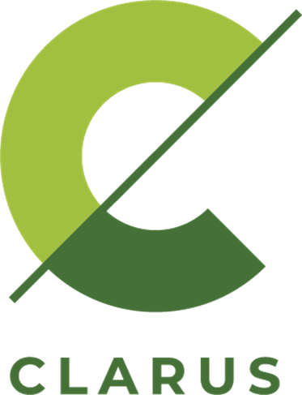
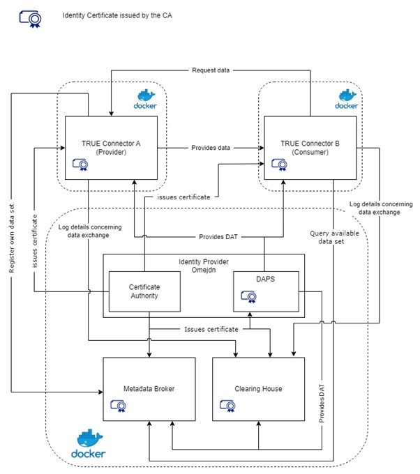

  

<!--the list of used link is at the bottom of the file-->

# Minimum Viable Data Space (MVDS) for Clarus Project
This repository provides a deployment scenario for a Minimum Viable Data Space ([MVDS][mvds]), defined according to the specifications of the International Data Spaces Association ([IDSA][idsa]). This solution is designed for data exchange within the CLARUS project.
The open-source TRUsted Engineering Connector ([TRUE Connector][true-connector]), developed by the Engineering group, will be utilized among the selected IDS components to implement this solution.
The installation and configuration procedures described in this document adhere to the guidelines established by the [IDS testbed][testbend].

## Table of contents
* [**Architecture**](#architecture)
* [**Support Team**](#support-team)
<!--* [**License**](#license)-->
<!--* [**Endpoints**](#endpoints)-->

## Architecture

## Support Team

| Name                        |        E-mail          |
| :-------------------------- | :--------------------: |
| [Luigi di Corrado][luigi]   | luigi.dicorrado@eng.it |
| [Gianluca Isgro'][gianluca] | gianluca.isgro@eng.it  |
| [Luca Di Lorenzo][luca]     | luca.dilorenzo@eng.it  |

<!--
## License
-->

<!--LIST OF LINKS USED-->

[luigi]: https://github.com/luidicorra

[gianluca]: https://github.com/gianluca-isgro

[luca]: https://github.com/ludilorenz

[mvds]: https://github.com/International-Data-Spaces-Association/IDS-testbed/blob/master/minimum-viable-data-space/MVDS.md

[idsa]: https://internationaldataspaces.org/

[true-connector]: https://github.com/Engineering-Research-and-Development/true-connector

[testbend]: https://github.com/International-Data-Spaces-Association/IDS-testbed/blob/master/InstallationGuide.md

[docker]: https://docs.docker.com/         

[omejdn]: https://github.com/Fraunhofer-AISEC/omejdn-server

[metadatabroker]: https://github.com/International-Data-Spaces-Association/metadata-broker-open-core

[clearinghouse]: https://github.com/International-Data-Spaces-Association/ids-clearing-house-service
